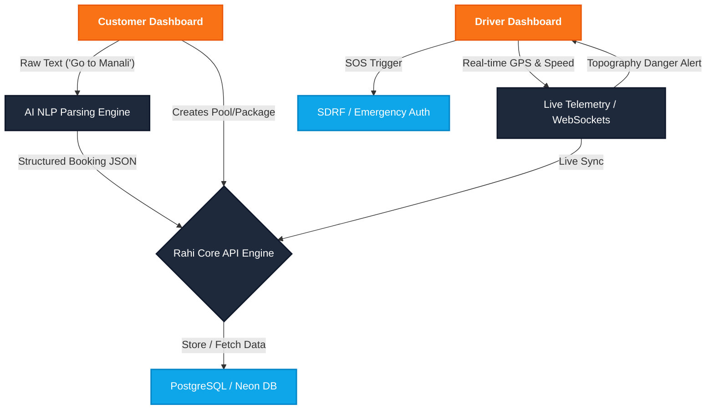
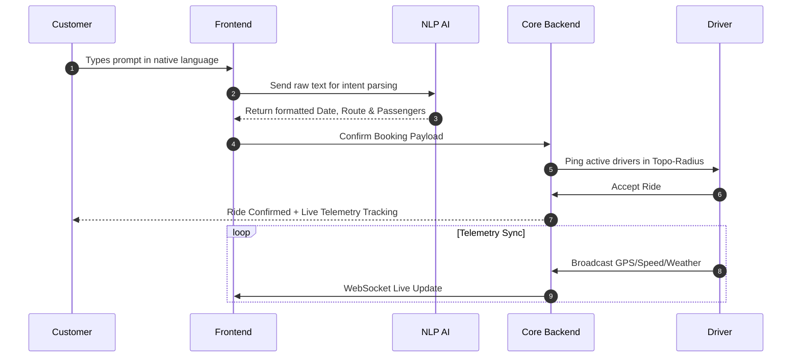

  

  

  
  
  
  
  
  

 

> **Rahi** is an intelligent, topography-aware mobility ecosystem designed to conquer the unique challenges of mountain transportation. Featuring live telemetry, AI-driven NLP bookings, and emergency SOS integrations, we're not just building a ride-sharing app—we are building a lifeline for the Himalayas.

---

## ✨ Jaw-Dropping Features

  <table>
    <tr>
      <td align="center">🧠 <b>AI NLP Booking</b> Just type "I want to go to Nainital tomorrow morning with 4 people" and AI handles the rest.</td>
      <td align="center">🛰️ <b>Live Telemetry</b> Real-time vehicle diagnostics, weather overlay, and topographical safety checks.</td>
      <td align="center">🌐 <b>Instant Bilingual</b> Real-time English & Hindi toggle capability across the entire app ecosystem.</td>
    </tr>
    <tr>
      <td align="center">🤝 <b>Smart Pooling</b> Algorithmically matches travelers to reduce mountain congestion & emissions.</td>
      <td align="center">🛡️ <b>SDRF SOS</b> Direct emergency response integration with local authorities in blind-spots.</td>
      <td align="center">🎨 <b>Dynamic UI/UX</b> Glassmorphism, 3D Scroll Triggers, and GPU-accelerated interactive particles.</td>
    </tr>
  </table>

---

## 🔄 Data Flow Diagram (DFD)

Our entire ecosystem is connected seamlessly in real-time. Here is how data moves across the platform:

---

## 🚀 How It Works (Architecture Sequence)

---

## 💻 Tech Stack Deep Dive

- **Frontend:** React 19, TailwindCSS, Framer Motion, Lucide Icons, Canvas API for Particle engines.
- **Backend:** Node.js, Express, REST + WebSockets.
- **Database:** PostgreSQL (Neon Tech Pooler).
- **AI/ML:** Custom NLP prompt parsing, Live Route Optimization.

---

 

  

  <h2>🏆 HackIndia Hackathon Project</h2>
  
Proudly designed, developed, and deployed by <b>Team Predator</b>.

  
  

    <b>Team Leader:</b>  
    
  

   
  <i>"Conquering heights with code."</i>

